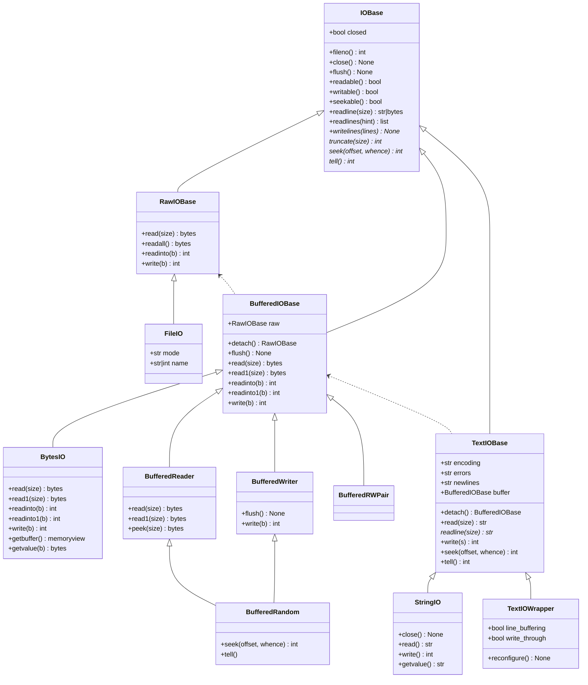

# File Object, I/O

File objects are also called *file-like objects* or **streams**.

## Categories of File Objects

- **raw I/O** (**unbuffered I/O**, *raw binary files*)
- **binary I/O** (*buffered binary files*)
- **text I/O** (*text files*)

Their interfaces are defined in the **`io`** module.
The canonical way to create a file object is by using the **`open()`** function.

## I/O Class Hierarchy



## Raw I/O

Also called **unbuffered I/O**.

### Usage

Rarely useful to directly manipulate a raw stream from user code.

```python
with open('path to file', 'wb+', buffering=0) as f:
    assert isinstance(f, io.FileIO)
    assert f.mode == 'rb+'
    data: bytes = f.read()
    f.write(data)
```

equivalent to:

```python
with io.FileIO('path to file', 'w+') as f:
    assert isinstance(f, io.FileIO)
    assert f.mode = 'rb+'
    ...
```

### `io.FileIO`

A raw binary stream representing an OS-level file containing bytes data:

```python
class io.FileIO(name: str | bytes | int,
    mode: str = 'r',  # r, w, a, x, +
    closefd: bool = True,
    opener: Callable[(name, flags), int] | None = None)
```

### For existing OS-level file descriptors

```python
fd = 100  # underlying file descriptor
closefd = True  # whether underlying file descriptor closed when FileIO object closed
with io.FileIO(fd, 'r', closefd=closefd) as f:
    assert f.fileno() == fd
```

### `seek()`

```python
seek(offset: int,
     whence: Literal[io.SEEK_SET, io.SEEK_CUR, io.SEEK_END] = io.SEEK_SET) -> int
```

## Binary I/O

Also called **buffered I/O**, expects *bytes-like objects* and produces *`bytes`* objects.

### Usage

#### Read/Write

```python
with open('x.png', 'wb+') as f:
    assert isinstance(f, io.BufferedRandom)

    assert f.readable()
    assert f.writable()
    data: bytes = f.read()
    f.write(data)

    assert f.seekable()
    curr_pos: int = f.tell()
    curr_pos: int = f.seek(0)
    curr_pos: int = f.seek(1, io.SEEK_CUR)
```

#### Read Only

```python
with open('x.png', 'rb') as f:
    assert isinstance(f, io.BufferedReader)

    assert f.readable()
    assert not f.writable()
    data: bytes = f.read()

    assert f.seekable()
    curr_pos: int = f.tell()
    curr_pos: int = f.seek(0)
    curr_pos: int = f.seek(1, io.SEEK_CUR)

    # similar with read(), but position not changed
    # At most one single read on the raw stream is done
    data: bytes = f.peek()
```

#### Write Only

```python
with open('x.png', 'rw') as f:
    assert isinstance(f, io.BufferedWriter)

    assert not f.readable()
    assert f.writable()
    f.write(b'data')

    assert f.seekable()
    curr_pos: int = f.tell()
    curr_pos: int = f.seek(0)
    curr_pos: int = f.seek(1, io.SEEK_CUR)
```

#### In-memory bytes buffer: `io.BytesIO`

```python
with io.BytesIO(b'data') as buf:
    assert f.readable()
    assert f.writable()
    data: bytes = buf.read()
    buf.write(data)

    data_view = buf.getbuffer()  # without copying
    all_data = buf.getvalue()  # Difference from `read()`: don't change file position

    assert f.seekable()
    curr_pos: int = f.tell()
    curr_pos: int = f.seek(0)
    curr_pos: int = f.seek(1, io.SEEK_CUR)
```

### `io.BufferedRandom`

```python
class io.BufferedRandom(raw: io.RawIOBase, buffer_size=io.DEFAULT_BUFFER_SIZE)
```

A buffered binary stream providing higher-level access to a **seekable** `RawIOBase` raw binary stream.

### `io.BufferedReader`

```python
class io.BufferedReader(raw: io.RawIOBase, buffer_size=io.DEFAULT_BUFFER_SIZE)
```

A buffered binary stream providing higher-level access
to a *readable*, *non seekable* *`RawIOBase`* raw binary stream.

### `io.BufferedWriter`

```python
class io.BufferedWriter(raw: io.RawIOBase, buffer_size=io.DEFAULT_BUFFER_SIZE)
```

A buffered binary stream providing higher-level access
to a *readable*, *non seekable* *`RawIOBase`* raw binary stream.

The internal buffer will be written out to the underlying *`RawIOBase`* object under various conditions,
including:

- when the buffer gets too small for all pending data;
- when *`flush()`* is called;
- when a *`seek()`* is requested (for `BufferedRandom` objects);
- when the `BufferedWriter` object is closed or destroyed.

### In-memory bytes buffer: `io.BytesIO`

```python
class io.BytesIO(initial_bytes: Optinal[bytes])
```

The buffer is discarded when the *`close()`* method is called.

- **`getbuffer()`** Return a readable and writable view over the contents of the buffer
without copying them.
- **`getvalue()`** Return bytes containing the entire contents of the buffer.
(Difference from `read()`: don't change file position)

## Text I/O

A file object able to read and write **`str`** objects.

### Usage

```python
# For UTF-8 with BOM, use encoding='utf-8-sig'
# errors=None same with errors='strict',
#   raise ValueError when encoding/decoding errors happened
# newlines=None: universal newlines mode
with open('x.txt', 'w+', encoding='utf-8') as f:
    assert isinstance(f, io.TextIOWrapper)

    assert f.readable()
    data: str = f.read()
    for line in f:
        pass

    assert f.writable()
    f.write(data)

    assert f.seekable()
    curr_pos: int = f.tell()
    curr_pos: int = f.seek(0)
    curr_pos: int = f.seek(1, io.SEEK_CUR)
```

### `io.TextIOWrapper`

```python
class io.TextIOWrapper(
    buffer: io.BufferedIOBase,
    encoding: str | None = None,  # default: locale.getpreferredencoding(False)
    errors: str | None = None,
    newline: str | None = None,  # default: universal newlines mode
    line_buffering: bool = False,
    write_through: bool = False)  # write immediately to the underlying binary buffer
```

A buffered text stream providing higher-level access to a *`BufferedIOBase`* buffered binary stream.

#### `reconfigure()`

New in Python *3.7*.

Reconfigure this text stream using new settings
for`encoding`, `errors`, `newline`, `line_buffering` 和 `write_through`.

Parameters not specified keep current settings.

It is not possible to change the *`encoding`* or *`newline`*
if some data has already been read from the stream.
On the other hand, changing *`encoding`* after write is possible.

This method does an implicit stream flush before setting the new parameters.

### `io.StringIO`

```python
class io.StringIO(initial_value: str = '', newline: str | None = '\n')
```

A text stream using an in-memory text buffer and will exhibit similar speed to `BytesIO`.

Example usage:

```python
import io

output = io.StringIO()
output.write('First line.\n')
print('Second line.', file=output)

# Retrieve file contents -- this will be
# 'First line.\nSecond line.\n'
# stream position is not changed (diff read())
contents = output.getvalue()

# Close object and discard memory buffer --
# .getvalue() will now raise an exception.
output.close()
```

## Thread-Safe

- `FileIO`: thread-safe
- Binary buffered: thread-safe
- `TextIOWrapper`: **not** thread-safe

## References

- [Python - `io` module](https://docs.python.org/3/library/io.html)
- [Python - `open()`](https://docs.python.org/3/library/functions.html#open)
- [PEP 3116 - New I/O](https://peps.python.org/pep-3116/)
- [PEP 278 - Universal Newline Support](https://peps.python.org/pep-0278/)
