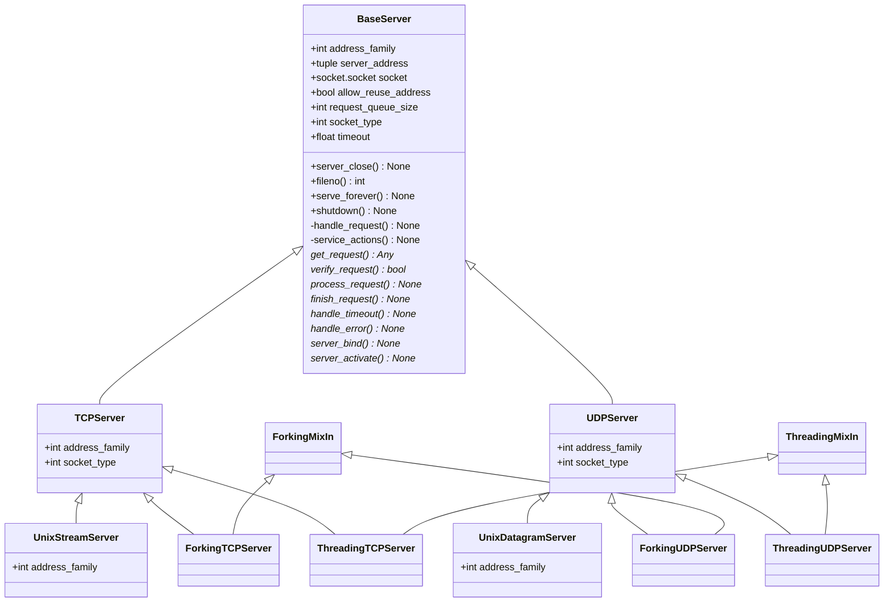

# `socketserver` Class Diagram

## Solution

## References

- [Python - `socket` module](https://docs.python.org/3/library/socket.html)
- [Python - `socketserver` module](https://docs.python.org/3/library/socketserver.html)
